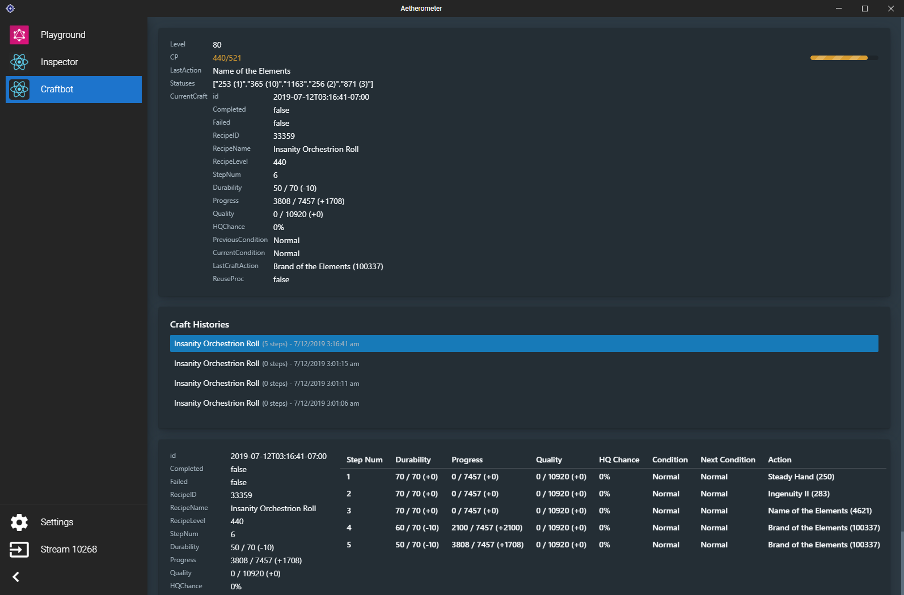

# Craftlog

Craftlog keeps track of your current and past crafts. You can see
the events of your craft live.

Using this tool is as simple as [adding it to Aetherometer](#installation).

## Features

- Displays current CP, actions used, condition procs, and recipe level.
- Tracks Progress, Quality, and Durability stats for a craft.
- Detects when your craft was completed successfully or failed.

Ever had a crafting macro fail you by using `Great Strides` on an
`Excellent` proc and `Byregot's Blessing` on the subsequent `Poor`
proc? Well now you can comfortably watch Netflix without having to
keep your eyes glued on the game while crafting!

## Installation

1. Go to Settings in Aetherometer
2. Check the streams (or process IDs) that you would like to inspect.
3. Fill in:
    - Plugin Name: Craftlog
    - Plugin URL: https://ff14wed.github.io/craftlog-plugin/
4. Click Add Plugin
5. You should now be able to navigate to Craftlog and start using it.

## For Developers

This project was bootstrapped with [Create React App](https://github.com/facebook/create-react-app).

When testing you can add http://localhost:3000 as the plugin URL to
Aetherometer and hit Ctrl+Shift+J to open a developer console.

Like other `create-react-app` projects, you have access to the typical
`npm start`, `npm build`,  or `yarn start`, `yarn build` commands.
